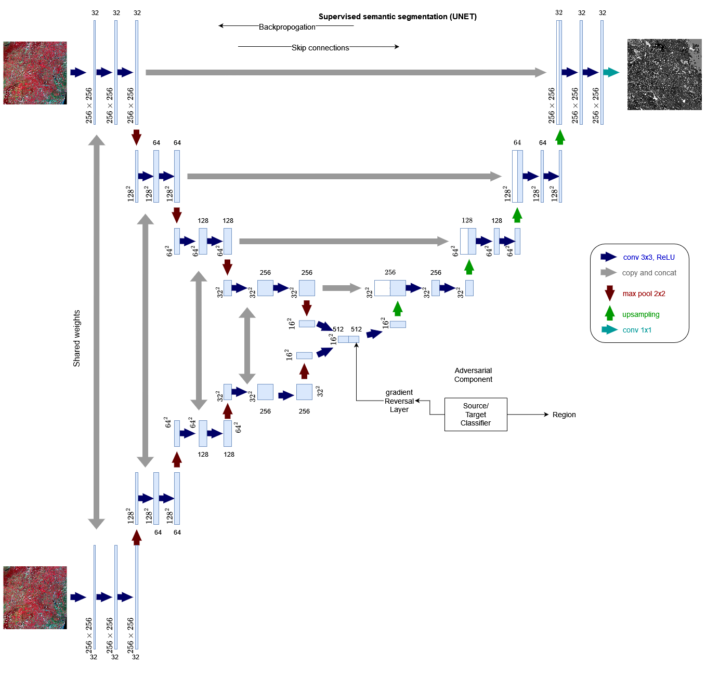
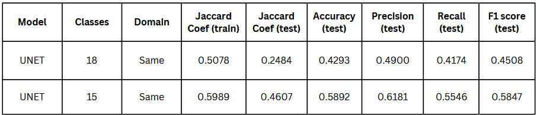
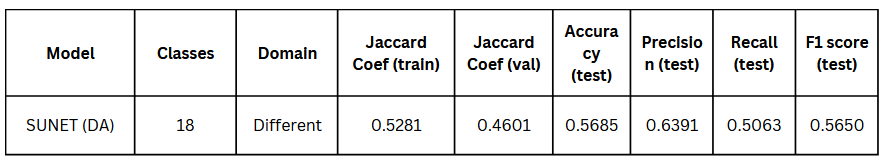
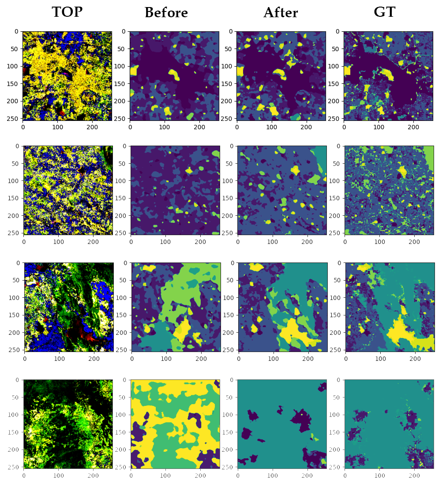

# SDUnet
Domain Adaptive Semantic Segmentation for Enhanced Crop and Land Use Mapping in India

Making a Domain Adaptive Semantic Segmentation by leveraging known networks like Unet, Siamese and gradient reversal layer. This model takes inspiration from change detection models and uses two images instead of one to better identify classes which cannot be determined by one image(season), these classes include kharif, rabi and zaid crops, waterbodies min/max spread, some forests, etc. The first image is taken from the March-April months and the second from the September-October months. 

Thesis - [files/Report_finalsem.pdf](files/Report_finalsem.pdf)
Dataset(images) - Copernicus and Google Earth Engine.
Dataset(masks) - Cannot be shared under NRSC/ISRO citation policy.

I would like to thank NRSC/ISRO for providing with the dataset and making this project possible.

# Model Architechture


## Citation
```
@article{unet,
  author={O. Ronneberger, P. Fischer,T. Brox},
  title={U-net: Convolutional networks for biomedical image segmentation},
  journal={Medical Image Computing and Computer-Assisted Intervention–MICCAI},
  url = {https://doi.org/10.1007/978-3-319-24574-4_28},
  year=2015
}
@article{siamembed,
  author={Guillermo Lloret-Talavera},
  title={Image classification using embedded spaces generated by Siamese Networks},
  journal={ University of Alicante, Spain},
  year=2019,
}
@article{changeDetect,
  title={Deep Active Learning in Remote Sensing for data efficient Change Detection},
  author={Vıt Ruzicka, Stefano D’Aronco, Jan Dirk Wegner, Konrad Schindler},
  journal={arXiv:2008.11201},
url ={https://www.researchgate.net/publication/343877160_Deep_Active_Learning_in_Remote_Sensing_for_data_efficient_Change_Detection},
  year={2020},
}
@article{backprop,
  title={Unsupervised Domain Adaptation by Backpropagation},
  author={Yaroslav Ganin, Victor Lempitsky},
  year= 2014,
}
```

## Training and Results

# Metrics

Old model results

Proposed model results

# Images


The results demonstrate the effectiveness of the proposed domain adaptation network compared to a standard U-Net architecture. 
Furthermore, comparing novel UNET with the results of the proposed model we can determine the proposed model is superior in predicting season-influenced classes. We can also observe the same in the below diagrams. The season-influenced classes are getting better predicted in the new model. 
